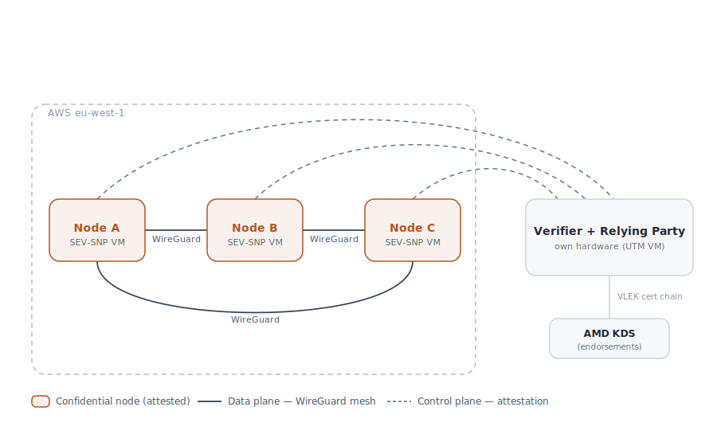
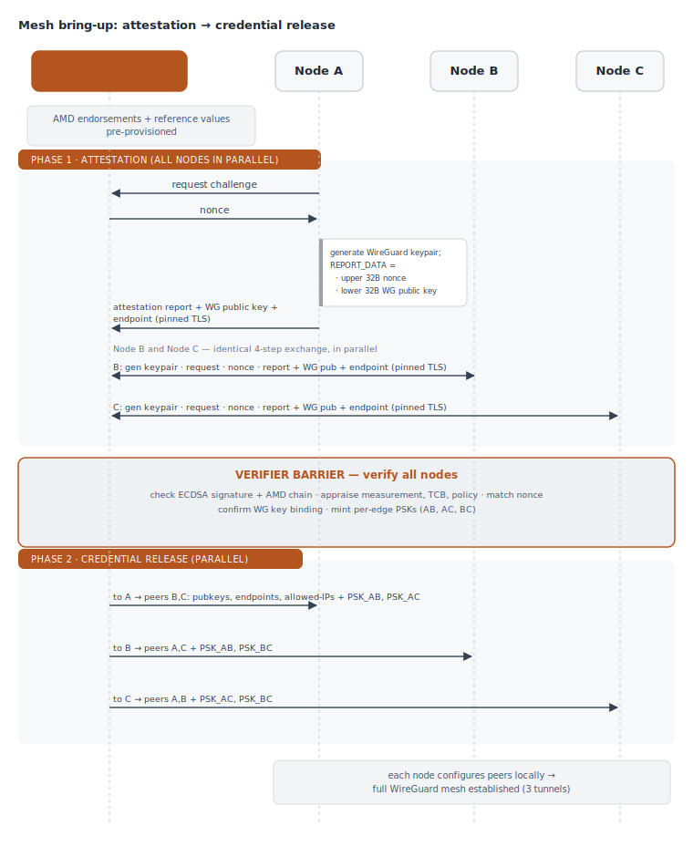

# Attestation-Gated WireGuard Mesh on AMD SEV-SNP

Three AMD SEV-SNP confidential VMs on AWS form a full WireGuard mesh, but only
after each node proves its integrity to an external verification service. The
verifier appraises each node's hardware-signed attestation report, and only
once all nodes pass does it hand out the WireGuard credentials that let the mesh
come up. The result is a network whose members are cryptographically known to be
genuine, unmodified confidential VMs.

<!-- TODO: one-line status (course, term) and a link to the source repo if any. -->

---

## 1. Motivation — why attest before meshing

A normal VPN trusts whoever holds the right key. That says nothing about the
*state* of the machine holding it: a node could be running tampered software, a
debug build, or an outdated firmware and still present a valid key. For a
confidential workload that is exactly the gap we want to close.

AMD SEV-SNP lets a VM produce a hardware-signed **attestation report**: a
measurement of its initial memory and vCPU state, signed by a key that chains
back to an AMD root of trust. Verifying that report before admitting a node to
the mesh means the network is built only from nodes that are (a) genuine SEV-SNP
hardware and (b) running the exact image we expect. Binding each node's WireGuard
key into its report ties the encrypted channel to the attested machine, so the
tunnel inherits the trust established by attestation.

Two honest limits stated up front: attestation here proves the **launch-time**
state, not that the node stays uncompromised at runtime; and because AWS reports
are VLEK-signed, the cloud provider is part of the trusted computing base.

## 2. Roles (RATS / RFC 9334)

This system is symmetric: every node is an Attester. The verifier combines two
RATS roles in one service — it both appraises evidence (Verifier) and decides to
release the credentials (Relying Party). That combined service is essentially a
minimal, single-purpose Key Broker; the productized equivalents are the CoCo
Trustee KBS/AS split or Azure MAA plus Key Vault Secure Key Release.

| RATS role             | Filled by                                  | Note |
|-----------------------|--------------------------------------------|------|
| Attester              | each of the 3 SEV-SNP nodes                | mutual attestation; all three prove themselves |
| Verifier              | verification service (own hardware)        | appraises every report |
| Relying Party         | same service (personal union)              | releases WireGuard credentials |
| Endorser              | AMD (ARK → ASVK → VLEK)                     | hardware authenticity |
| Reference Value Prov. | self-supplied                              | golden measurement, TCB minimums, policy flags |
| Verifier Owner        | implicitly the operator                    | no separate appraisal authority |

<!--
  Mutual attestation is what removed the earlier asymmetry: there is no longer a
  statically trusted peer key — every node's WG key is learned via its own report.
-->

## 3. Architecture

- **3 nodes** — SEV-SNP-enabled EC2 instances (c6a.large, Ubuntu 24.04+) in
  eu-west-1 (Ireland; one of the two AWS regions offering SEV-SNP). Each is both
  a confidential workload and an Attester.
- **Verifier** — runs on own hardware **outside** AWS, in a VM. This removes the
  AWS hypervisor from the verifier's TCB. It is not itself attested (see §6).
- **Control plane** — nodes initiate outbound HTTPS to the verifier (pinned
  self-signed certificate). Carries the attestation dialog and credential release.
- **Data plane** — the WireGuard full mesh between the three nodes. The verifier
  is not part of the mesh.



Full mesh = 3 tunnels (A–B, A–C, B–C). Each tunnel has its own preshared key.

## 4. Protocol flow

Because every node must attest before *any* tunnel can come up, the verifier acts
as a barrier: it collects all three reports, verifies them, and only then releases
each node's peer set.



Key binding uses the split REPORT_DATA layout: upper 32 bytes carry the verifier
nonce (freshness), lower 32 bytes carry the raw X25519 WireGuard public key
(binding). Both halves sit under the same ECDSA signature.

---

## 5. Configuration

<!-- This is the core of the README. Fill the TODOs with real values as you build. -->

### 5.1 Attestation interface (REST contract)

Both the node-side attestation client (§5.3) and the verifier service (§5.5)
implement this contract. REST over HTTPS, JSON bodies, the verifier's TLS
certificate pinned by every node. Three endpoints.

**1. Request a challenge** — `POST /v1/challenge`

```json
// request
{ "node_id": "A" }
// response
{ "session_id": "9f2c…", "nonce": "<base64, 32 bytes>" }
```

The `nonce` is fresh and random per request. `node_id` selects the node's mesh
slot/address from the verifier's config — convenience, not a trust anchor (see
notes).

**2. Submit evidence** — `POST /v1/attest`

```json
// request
{
  "session_id":    "9f2c…",
  "report":        "<base64 of the raw SEV-SNP attestation report>",
  "cert_chain":    "<base64 PEM bundle VLEK -> ASVK -> ARK>",
  "wg_public_key": "<base64, 32 bytes, raw X25519>",
  "endpoint":      "203.0.113.10:51820"
}
// success
{ "status": "verified" }
// failure (HTTP 4xx)
{ "status": "rejected", "reason": "measurement_mismatch" }
```

The node builds `REPORT_DATA` as `nonce (32 B) || wg_public_key (32 B)`, so the
verifier cross-checks both halves against the issued nonce and the
`wg_public_key` field. Per-node appraisal is decided here and fails fast;
`reason` is one of `signature_invalid`, `measurement_mismatch`,
`tcb_below_minimum`, `policy_violation`, `nonce_mismatch`, `binding_mismatch`.

**3. Fetch credentials** — `GET /v1/credentials?session_id=9f2c…`

```json
// barrier not yet satisfied (HTTP 202)
{ "status": "pending", "verified": 2, "expected": 3 }
// ready (HTTP 200)
{
  "status": "ready",
  "self_address": "10.0.0.1/24",
  "listen_port": 51820,
  "peers": [
    { "public_key": "<wg_pub_B>", "endpoint": "203.0.113.11:51820",
      "allowed_ips": "10.0.0.2/32", "preshared_key": "<PSK_AB>" },
    { "public_key": "<wg_pub_C>", "endpoint": "203.0.113.12:51820",
      "allowed_ips": "10.0.0.3/32", "preshared_key": "<PSK_AC>" }
  ]
}
```

The barrier lives here: `/attest` returns as soon as *this* node is appraised,
but credentials are withheld until every expected node has passed. Nodes poll
this endpoint until it returns `ready`. Because nodes initiate outbound (the
verifier is behind NAT, §3), polling fits the connection direction; long-polling
is an alternative that trades fewer round-trips for held-open connections.

Three points worth stating explicitly:

- **Endorsements are validated, not trusted on supply.** The node may include the
  `cert_chain` it fetched via snpguest, but the verifier validates it up to the
  AMD root it already trusts — trust comes from that known root, not from the
  node's submission. The verifier may equally fetch the chain from the AMD KDS
  itself.
- **`node_id` / slot is configuration, not attested.** Which mesh address a node
  receives is assignment, not a trust decision. In this symmetric design every
  node that passes appraisal is an equal member — membership *is* passing the
  appraisal.
- **`session_id` is a secret capability.** It is the handle to fetch credentials,
  so it is random and stays on the pinned-TLS channel. The deeper protection
  remains the key binding: released credentials are only usable by the holder of
  the attested WG private key.

### 5.2 Prerequisites

- AWS region: eu-west-1. <!-- TODO: confirm account limits / SEV-SNP enabled -->
- Instance type: c6a.large (or other SEV-SNP-capable type). <!-- TODO -->
- AMI: Ubuntu 24.04+ with SEV-SNP support, uefi boot mode. <!-- TODO: AMI ID -->
- Security group: allow inbound UDP on the WireGuard port between the three node
  public IPs; allow the nodes outbound 443 to the verifier. <!-- TODO: SG IDs -->
- Tunnel address plan: 10.0.0.1/2/3 within 10.0.0.0/24. <!-- TODO: confirm -->

### 5.3 Node setup (per SEV-SNP VM)

Every node runs the same steps. They are the client side of the §5.1 contract:
generate a WireGuard key, bind it into the attestation report, submit the
evidence, then apply the returned peer set. Steps 1–3 are one-time host setup;
steps 4–8 are what the attestation client automates.

**1. Launch with SEV-SNP enabled.** It can only be turned on at launch and cannot
be disabled afterwards. Use a supported type (c6a/m6a/r6a) in a supported region
(`eu-west-1` or `us-east-2`) with a UEFI-boot Ubuntu 24.04 AMI.

```bash
aws ec2 run-instances \
  --image-id <ubuntu-24.04-ami> \        # TODO: AMI ID in eu-west-1, uefi boot mode
  --instance-type c6a.large \
  --key-name <key-pair> \               # TODO
  --subnet-id <subnet-id> \             # TODO
  --security-group-ids <sg-id> \        # TODO: UDP 51820 between nodes; outbound 443 to verifier
  --cpu-options AmdSevSnp=enabled

# confirm it took effect (AmdSevSnp should read "enabled"):
aws ec2 describe-instances --instance-ids <id> \
  --query 'Reservations[].Instances[].CpuOptions'
```

**2. Install WireGuard and build snpguest.**

```bash
sudo apt update && sudo apt install -y wireguard build-essential
sudo snap install rustup --classic && rustup default stable
git clone https://github.com/virtee/snpguest.git
cd snpguest && cargo build -r          # ~12 min; binary at target/release/snpguest
```

**3. Generate the WireGuard keypair** inside the VM. The private key never leaves
it; the public key (base64 of 32 raw bytes) is what gets bound and submitted.

```bash
umask 077
wg genkey | tee wg_private.key | wg pubkey > wg_public.key
```

**4. Request a challenge** (§5.1, endpoint 1):

```text
POST /v1/challenge  {"node_id":"A"}  ->  {"session_id": ..., "nonce": <base64 32B>}
```

**5. Build REPORT_DATA and request the report.** The 64-byte request file is the
split layout: nonce in bytes 0–31, raw X25519 public key in bytes 32–63. Decode
both from base64 to raw bytes, concatenate to exactly 64 bytes, then pass the file
to snpguest **without** `--random` — we supply our own REPORT_DATA, not a random
value (which is the only deviation from the stock Ubuntu/AWS guide).

```bash
# nonce_raw = base64-decode(nonce from step 4)          # 32 bytes
# wgpub_raw = base64-decode(contents of wg_public.key)  # 32 bytes
# cat nonce_raw wgpub_raw > request-data.bin            # exactly 64 bytes
#   (verify the expected request-data format/size with: snpguest report --help)

cd target/release
sudo ./snpguest report report.bin /path/to/request-data.bin   # no --random
sudo ./snpguest certificates pem ./                           # extracts host-provided vlek.pem
```

Fetch the VLEK certificate chain from the AMD KDS. `Milan` is the 3rd-gen EPYC
codename that c6a uses; a Genoa-based type would use a different path.

```bash
curl --proto '=https' --tlsv1.2 -sSf \
  https://kdsintf.amd.com/vlek/v1/Milan/cert_chain -o cert_chain.pem
cat vlek.pem cert_chain.pem > chain.pem      # VLEK -> ASVK -> ARK, for submission
```

Optional local sanity check (the real appraisal is the verifier's job):

```bash
sudo ./snpguest verify attestation ./ report.bin
```

**6. Submit evidence** (§5.1, endpoint 2). Base64-encode `report.bin` and
`chain.pem`, send them with the public key and this node's WireGuard endpoint
(public IP:port):

```text
POST /v1/attest  {session_id, report(b64), cert_chain(b64), wg_public_key(b64), endpoint}
  ->  {"status":"verified"}   or 4xx {"status":"rejected","reason": ...}
```

**7. Poll for credentials** (§5.1, endpoint 3) until the barrier releases:

```text
GET /v1/credentials?session_id=...   ->  202 pending ...  then  200 ready {self_address, peers[...]}
```

**8. Render the WireGuard config and bring up the interface.** Write the returned
peer set into `/etc/wireguard/wg0.conf` (template in §5.4), using the local
private key from step 3, then:

```bash
sudo wg-quick up wg0
sudo wg show          # confirm handshakes with both peers
```

<!-- TODO: link the attestation client script once written; document its config
     (verifier URL, pinned certificate). It wraps steps 4-8. -->

### 5.4 WireGuard config (template, Node A shown)

Assembled **after** attestation from the verifier's response. Private keys and
PSKs are generated/received at runtime and are **never committed to the repo**.

```ini
[Interface]
PrivateKey = <generated inside the VM, never leaves it>
Address    = 10.0.0.1/24
ListenPort = 51820        # TODO: confirm port (must match security group)

[Peer]   # Node B
PublicKey    = <wg_pub_B from verifier>
Endpoint     = <public_ip_B>:51820
AllowedIPs   = 10.0.0.2/32
PresharedKey = <PSK_AB from verifier>

[Peer]   # Node C
PublicKey    = <wg_pub_C from verifier>
Endpoint     = <public_ip_C>:51820
AllowedIPs   = 10.0.0.3/32
PresharedKey = <PSK_AC from verifier>
```

<!-- Nodes B and C are analogous with their own two peers and the matching PSKs. -->

### 5.5 Verifier setup (own hardware)

The verifier is a Python web service on the UTM VM and the only place appraisal
happens. It implements the server side of the §5.1 contract. It is not itself
attested (see §6); on own hardware it is anchored by physical control.

**Responsibilities per endpoint.**

- `/v1/challenge` — issue a fresh 32-byte random nonce, open a session keyed by
  `node_id`, store `{nonce, status: awaiting_evidence}`.
- `/v1/attest` — parse and check the submitted report, then mark the session
  `verified` or reject with a reason.
- `/v1/credentials` — withhold until the barrier is satisfied, then return the
  node's peer set.

**Report parsing.** Parse `report.bin` along the AMD ABI attestation-report layout
(Table 23) with Python `struct`, little-endian, accounting for reserved/padding.
Extract at minimum `version`, `policy`, `current_tcb` / `reported_tcb`,
`report_data` (64 B), `measurement` (48 B), and the signature. Validate the parser
once against `snpguest display report report.bin` so the offsets are known-good
before anything depends on them.

**Cryptographic verification — delegate, do not hand-roll.** Two checks: the report
is signed by the VLEK leaf (ECDSA P-384), and the VLEK chains to the AMD root (ARK)
the verifier trusts. Both are error-prone by hand (P-384 r/s endianness, chain
handling), so delegate them to a vetted implementation. Simplest is to run
snpguest on the verifier over the submitted report and certs
(`snpguest verify attestation <certs-dir> report.bin`, plus chain validation
against the cached AMD root); the virtee `sev` crate is the library alternative.
The verifier caches the AMD root once and does not trust node-supplied certs
beyond validating them to that root.

**Appraisal (your Python logic), fail-fast at `/v1/attest`,** each failure mapped
to a contract `reason`:

- `measurement` equals the golden measurement (§5.6) — else `measurement_mismatch`
- `reported_tcb` >= the four TCB minimums (§5.6) — else `tcb_below_minimum`
- `policy` flags as expected, e.g. debug disabled — else `policy_violation`
- `report_data[0:32]` equals this session's nonce — else `nonce_mismatch`
- `report_data[32:64]` equals the submitted `wg_public_key` — else `binding_mismatch`
- signature or chain invalid — `signature_invalid`

**Barrier and credential assembly.** Hold every passing session until all expected
nodes (here 3) are `verified`. Then assign tunnel addresses by `node_id`
(A -> 10.0.0.1, B -> 10.0.0.2, C -> 10.0.0.3), mint one preshared key per mesh
edge, and build each node's peer set. `/v1/credentials` returns `pending` with a
count until then, `ready` afterwards.

```bash
wg genpsk     # one per edge: PSK_AB, PSK_AC, PSK_BC  (or secrets.token_bytes(32) in Python)
```

**TLS (pinned self-signed).** Generate the certificate with the verifier's public
hostname in the SAN, serve HTTPS with it, and ship the certificate to every node
as their sole trusted CA — nodes pin it (`requests ... verify=verifier.crt`) and
reject anything else. This authenticates the verifier to the nodes; it does not
authenticate the report (the AMD signature does that).

```bash
openssl req -x509 -newkey ec -pkeyopt ec_paramgen_curve:prime256v1 -nodes \
  -keyout verifier.key -out verifier.crt -days 365 \
  -subj "/CN=<verifier-hostname>" -addext "subjectAltName=DNS:<verifier-hostname>"
```

**Reachability.** The verifier is outside AWS, behind NAT (§3). Forward port 443 to
the UTM VM and give it a stable name via dynamic DNS; nodes connect outbound to
`https://<verifier-hostname>/v1/...`. The verifier is never a WireGuard peer —
that would be a chicken-and-egg with the mesh it gates.

<!-- TODO: link the verifier source once written; note where verifier.crt is pinned on nodes. -->

### 5.6 Reference values

These are what `/v1/attest` appraises against (§5.5). They live in the verifier's
config and must come from a trusted source separate from the evidence — a node
must not be able to supply its own expected values.

**Golden measurement (48 bytes)** — the expected launch measurement, derived in
two steps:

1. *Stability baseline:* launch a node twice with identical configuration and
   compare the `measurement` field. A stable value is a candidate golden
   measurement.
2. *Independent reconstruction:* try to recompute it with `sev-snp-measure` from
   the OVMF firmware (plus kernel/initrd/cmdline for direct boot) and the vCPU
   setup. On AWS this is the hard part — the measured early-boot OVMF runs before
   the AMI and is AWS-provided, so the exact inputs may be unavailable. If it
   matches, the value is strongly grounded; if it cannot be reproduced, document
   it honestly as a **trust-on-first-use (TOFU) baseline** from observed stable
   launches.

A TOFU baseline detects drift from the first observed launch (a changed image or
firmware) but does not by itself prove the baseline corresponds to known-good
source; note this in §6. Expect the baseline to change legitimately when AWS
updates the underlying OVMF, so treat a mismatch as "investigate", not
automatically "attack". <!-- TODO: record the actual measurement and which path succeeded. -->

**TCB minimums** — the reported TCB has four components (bootloader, TEE, SNP
firmware, microcode). Set a minimum acceptable version for each and reject any
report with a component below it; this is anti-rollback against known-vulnerable
firmware. Read the current platform TCB from a known-good report and set the
minimums there (or AMD's recommended floor); they should track upward as AWS
patches the platform. <!-- TODO: record the four minimum versions. -->

**Policy flags** — the report's `policy` field encodes the guest policy fixed at
launch. The security-relevant expectation is debug disabled; the remaining bits
(SMT, migration-agent association, minimum ABI major/minor) are checked against
expected values per the ABI policy definition. Reject anything that does not
match. <!-- TODO: pin the exact expected policy value/bitmask. -->

## 6. Trust assumptions and limitations

- **Verifier is not self-attested.** It is trusted by physical control of the
  hardware, which removes the AWS hypervisor from its TCB but does not protect
  against a remote compromise of the verifier process. Managed solutions (Azure
  MAA in an SGX enclave) attest the verifier itself; this lab does not.
- **Launch-time, not runtime.** Attestation proves the state at launch. It does
  not detect later in-memory compromise.
- **CSP in the TCB.** AWS reports are VLEK-signed, so AWS is trusted for key
  provisioning.
- **All node identities are attested.** With mutual attestation there is no
  statically trusted peer key — an improvement over an asymmetric design.
- **Bootstrap.** Reference values and the verifier's reachability are
  pre-provisioned/assumed. Availability and DoS are out of scope.

## 7. References

<!-- TODO: tidy into a consistent style. -->

- RFC 9334 — Remote ATtestation procedureS (RATS) Architecture
- AMD — SEV Secure Nested Paging Firmware ABI Specification (Pub. 56860)
- J. A. Donenfeld — WireGuard: Next Generation Kernel Network Tunnel (NDSS 2017)
- AWS — Attest an Amazon EC2 instance with AMD SEV-SNP (EC2 User Guide)
- Related work — CoCo Trustee (KBS/AS), Azure MAA + Key Vault Secure Key Release